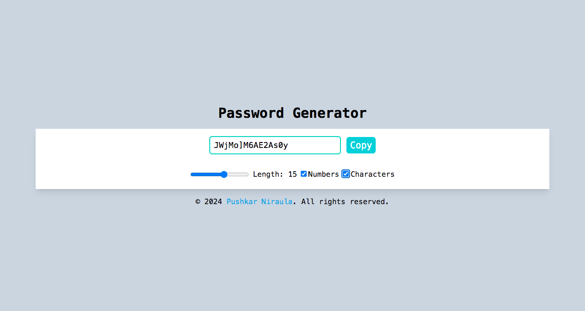

# Password Generator 🔒

A simple password generator built with React that allows users to customize the length and character set of their password, with options for including numbers and special characters.

## Screenshot




## Features

- **Customizable Length**: Set password length between 8 and 20 characters.
- **Include Numbers**: Option to include numbers in the generated password.
- **Include Special Characters**: Option to include special characters.
- **Copy to Clipboard**: Easily copy the generated password with one click.

## Technologies Used

- React (useState, useCallback, useEffect, useRef hooks)
- Tailwind CSS for styling

## Getting Started

### Prerequisites

- Node.js (version 14 or above recommended)

### Installation

1. Clone this repository:

```bash
git clone https://github.com/yourusername/password-generator.git
```

2. Install dependencies:

```bash
cd password-generator
npm install
npm start
```

### Usage

- Adjust the Length slider to set the desired password length.
- Toggle Numbers and Characters checkboxes to include numbers or special characters.
- Click Copy to save the generated password to your clipboard.

### Demo

[Live Demo]([https://hexlock.netlify.app/]) - Check out the live version of this password generator

### License

This project is licensed under the MIT License.

### Author

👤 Pushkar Niraula

Website: https://www.pushkarniraula.com.np
